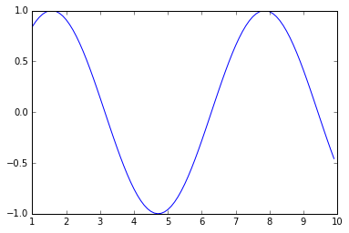

```python
# data preprocessing
import pandas as pd
```


```python
train = pd.read_csv('train.csv')
x_train = train.iloc[ :, :-1].values
y_train = train.iloc[:, -1]

```


```python
train.isnull().values.any()

```


    False


```python
# feature scaling
from sklearn.preprocessing import StandardScaler
sc_x = StandardScaler()
x_train = sc_x.fit_transform(x_train)

```


```python
# encoding categorical values
from sklearn.preprocessing import LabelEncoder
le = LabelEncoder()
y_train = le.fit_transform(y_train)

```


```python
# implementing random forest classifier
from sklearn.ensemble import RandomForestClassifier
classifier = RandomForestClassifier(n_estimators=10, criterion='gini', max_features=100, random_state=0)
classifier.fit(x_train, y_train)

```


    RandomForestClassifier(bootstrap=True, class_weight=None, criterion='gini',
                max_depth=None, max_features=100, max_leaf_nodes=None,
                min_impurity_decrease=0.0, min_impurity_split=None,
                min_samples_leaf=1, min_samples_split=2,
                min_weight_fraction_leaf=0.0, n_estimators=10, n_jobs=1,
                oob_score=False, random_state=0, verbose=0, warm_start=False)


```python
# test data
# importing
test = pd.read_csv('test.csv')
x_test = test.iloc[ :, :-1].values
y_test = test.iloc[:, -1]

```


```python
test.isnull().values.any()

```


    False


```python
# feature scaling
x_test = sc_x.fit_transform(x_test)

```


```python
# encoding categorical values
y_test = le.fit_transform(y_test)

```


```python
# predicting the result
y_pred = classifier.predict(x_test)

```


```python
# checking accuracy
from sklearn.metrics import confusion_matrix
cm = confusion_matrix(y_test, y_pred)
cm
```


    array([[537,   0,   0,   0,   0,   0],
           [  0, 466,  25,   0,   0,   0],
           [  0, 384, 148,   0,   0,   0],
           [  0,   0,   0, 462,  26,   8],
           [  0,   0,   0,   5, 387,  28],
           [  0,   0,   0,  46,  46, 379]])


```python
# k-fold cross validation score
from sklearn.model_selection import cross_val_score
accuracies = cross_val_score(estimator = classifier, X = x_train, y = y_train, cv=10)
print("mean of the accuracies is ",accuracies.mean())
print("standard deviation of amodel is", accuracies.std())

```

    mean of the accuracies is  0.906344676274
    standard deviation of amodel is 0.0433726674249


```python
# checking accuracy
from sklearn.metrics import accuracy_score
accuracy = accuracy_score(y_test, y_pred)
accuracy*100
```


    80.726162198846282


```python
import numpy as np
import matplotlib.pyplot as plt
from math import sin
```


```python
x = np.arange(1, 10, 0.1)
y = [sin(a) for a in x]
x
```


    array([ 1. ,  1.1,  1.2,  1.3,  1.4,  1.5,  1.6,  1.7,  1.8,  1.9,  2. ,
            2.1,  2.2,  2.3,  2.4,  2.5,  2.6,  2.7,  2.8,  2.9,  3. ,  3.1,
            3.2,  3.3,  3.4,  3.5,  3.6,  3.7,  3.8,  3.9,  4. ,  4.1,  4.2,
            4.3,  4.4,  4.5,  4.6,  4.7,  4.8,  4.9,  5. ,  5.1,  5.2,  5.3,
            5.4,  5.5,  5.6,  5.7,  5.8,  5.9,  6. ,  6.1,  6.2,  6.3,  6.4,
            6.5,  6.6,  6.7,  6.8,  6.9,  7. ,  7.1,  7.2,  7.3,  7.4,  7.5,
            7.6,  7.7,  7.8,  7.9,  8. ,  8.1,  8.2,  8.3,  8.4,  8.5,  8.6,
            8.7,  8.8,  8.9,  9. ,  9.1,  9.2,  9.3,  9.4,  9.5,  9.6,  9.7,
            9.8,  9.9])


```python
plt.plot(x,y)
```


    [<matplotlib.lines.Line2D at 0x7f3828f8ac18>]




